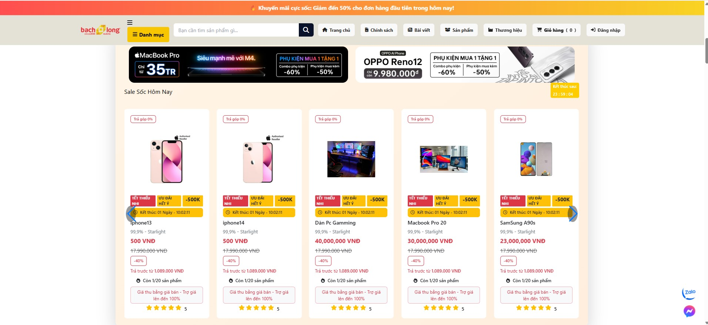
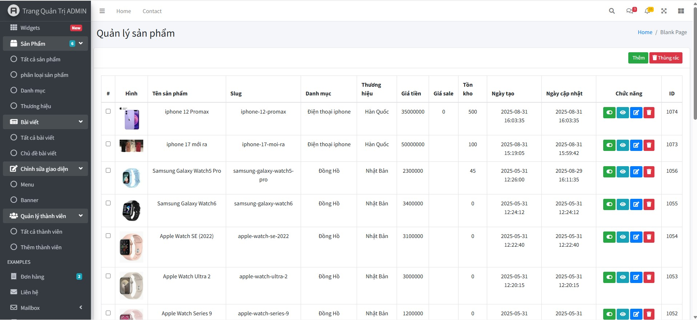
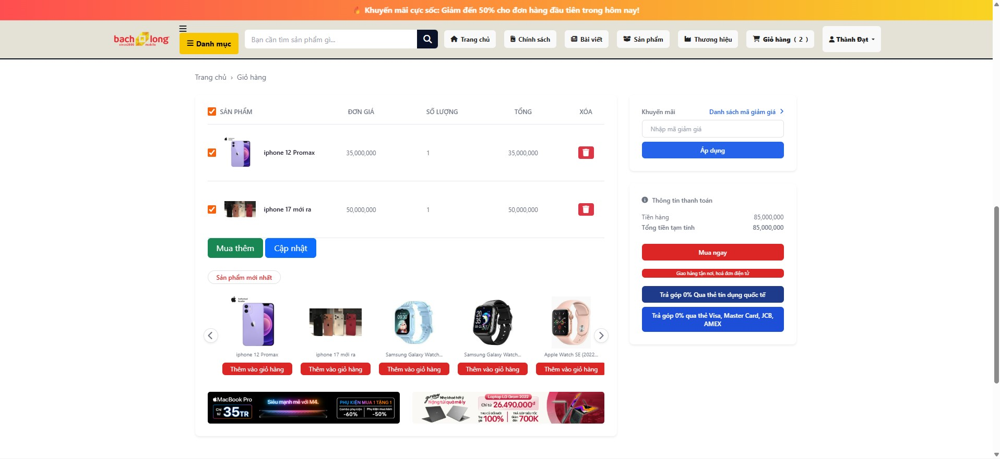
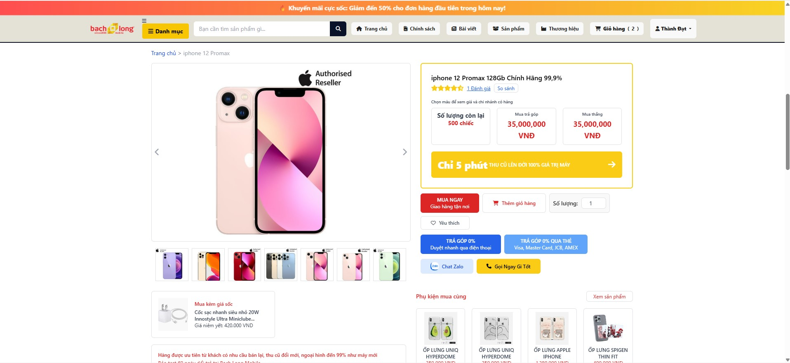

<div align="center">

# 📱 Nền Tảng Thương Mại Điện Tử SmartPhone

### Giải Pháp E-Commerce Hiện Đại Trên Nền Tảng Laravel

[](https://laravel.com)
[](https://php.net)
[](https://getbootstrap.com)
[](https://mysql.com)
[](LICENSE)

[Tính năng](#-tính-năng-chính) • [Demo](#-demo) • [Cài đặt](#-cài-đặt) • [Tài liệu](#-tài-liệu) • [Hỗ trợ](#-hỗ-trợ)

---

</div>

## 📖 Mục Lục

- [Tổng quan](#-tổng-quan)
- [Tính năng chính](#-tính-năng-chính)
- [Công nghệ sử dụng](#-công-nghệ-sử-dụng)
- [Yêu cầu hệ thống](#-yêu-cầu-hệ-thống)
- [Cài đặt](#-cài-đặt)
- [Cấu hình](#-cấu-hình)
- [Hướng dẫn sử dụng](#-hướng-dẫn-sử-dụng)
- [Cấu trúc dự án](#-cấu-trúc-dự-án)
- [Cấu trúc Database](#-cấu-trúc-database)
- [Tài liệu API](#-tài-liệu-api)
- [Ảnh minh họa](#-ảnh-minh-họa)
- [Triển khai](#-triển-khai)
- [Đóng góp](#-đóng-góp)
- [Giấy phép](#-giấy-phép)
- [Liên hệ](#-liên-hệ)

---

## 🎯 Tổng Quan

**Nền Tảng Thương Mại Điện Tử SmartPhone** là một hệ thống bán hàng trực tuyến toàn diện, được xây dựng trên Laravel 11, chuyên cung cấp điện thoại thông minh, laptop, PC và phụ kiện công nghệ. Hệ thống có giao diện hiện đại, responsive với đầy đủ tính năng thương mại điện tử phù hợp cho triển khai thực tế.

### 🌟 Điểm Nổi Bật

```
✨ Giao diện hiện đại, responsive trên mọi thiết bị
🔐 Hệ thống phân quyền mạnh mẽ (Admin/User)
📦 Quản lý sản phẩm nâng cao với nhiều thuộc tính
🛒 Giỏ hàng thông minh và hệ thống thanh toán
📰 Quản lý blog và tin tức tích hợp
♻️ Tính năng xóa mềm với khả năng khôi phục dữ liệu
🔍 Tìm kiếm và lọc nâng cao
📊 Dashboard phân tích theo thời gian thực
🎨 Giao diện và bố cục tùy chỉnh
🚀 Tối ưu cho hiệu suất và SEO
```

---

## ✨ Tính Năng Chính

<table>
<tr>
<td width="50%">

### 👨‍💼 Quản Trị Viên

#### Dashboard & Phân Tích
- 📊 Thống kê bán hàng theo thời gian thực
- 📈 Biểu đồ doanh thu tương tác
- 📋 Bảng theo dõi đơn hàng
- 👥 Phân tích khách hàng
- 📦 Quản lý tồn kho

#### Quản Lý Sản Phẩm
- ✅ CRUD đầy đủ
- 📸 Hỗ trợ upload nhiều ảnh
- 🎨 Thuộc tính sản phẩm (màu sắc, dung lượng)
- 💰 Quản lý giá và giảm giá
- 📊 Theo dõi tồn kho
- ♻️ Xóa mềm & khôi phục

#### Quản Lý Nội Dung
- 📂 Quản lý danh mục phân cấp
- 🏷️ Quản lý thương hiệu với logo
- 📰 Tạo và chỉnh sửa bài viết blog
- 🎫 Quản lý banner/slider
- 🗂️ Công cụ tối ưu SEO

</td>
<td width="50%">

### 👤 Khách Hàng

#### Trải Nghiệm Mua Sắm
- 🏠 Trang chủ động với sản phẩm nổi bật
- 🔍 Tìm kiếm và lọc nâng cao
- 📱 Trang chi tiết sản phẩm với thư viện ảnh
- 🛒 Giỏ hàng thông minh
- 💳 Quy trình thanh toán bảo mật
- 📜 Theo dõi lịch sử đơn hàng

#### Tài Khoản Người Dùng
- 👤 Quản lý hồ sơ
- 🔐 Xác thực bảo mật
- 📧 Thông báo qua email
- 💾 Danh sách yêu thích
- 🔄 Theo dõi đơn hàng

#### Tính Năng Bổ Sung
- 📰 Phần blog & tin tức
- 📞 Form liên hệ
- 🌍 Hỗ trợ đa ngôn ngữ (sẵn sàng)
- 💬 Đánh giá của khách hàng
- 🔔 Hệ thống thông báo

</td>
</tr>
</table>

---

## 💻 Công Nghệ Sử Dụng

### Backend
```yaml
Framework:     Laravel 11.x
Ngôn ngữ:      PHP 8.2+
Database:      MySQL 8.0+ / MariaDB 10.6+
ORM:           Eloquent
Xác thực:      Laravel Breeze/Sanctum
Cache:         Redis (tùy chọn)
Hàng đợi:      Database/Redis
```

### Frontend
```yaml
Template:      Blade Components
CSS:           Bootstrap 5.x + Custom CSS
JavaScript:    Vanilla JS (ES6+) + jQuery
Icons:         Font Awesome 6
WYSIWYG:       Summernote Editor
Biểu đồ:       Chart.js
DataTables:    DataTables.net
Thông báo:     SweetAlert2
```

### Công Cụ Phát Triển
```yaml
Quản lý gói:      Composer, NPM
Build Tool:       Vite/Laravel Mix
Quản lý phiên bản: Git
Chuẩn code:       PSR-12
Testing:          PHPUnit
```

---

## 📋 Yêu Cầu Hệ Thống

### Yêu Cầu Tối Thiểu

| Thành phần | Phiên bản |
|-----------|---------|
| **PHP** | 8.2 trở lên |
| **Composer** | 2.5 trở lên |
| **MySQL/MariaDB** | 8.0+ / 10.6+ |
| **Node.js** | 18.x trở lên |
| **Web Server** | Apache 2.4+ / Nginx 1.18+ |
| **RAM** | Tối thiểu 512 MB |
| **Ổ cứng** | 1 GB dung lượng trống |

### PHP Extensions Yêu Cầu
```
bcmath, ctype, fileinfo, json, mbstring, openssl, 
pdo, pdo_mysql, tokenizer, xml, gd/imagick, curl, zip
```

### Khuyến Nghị Cho Production
```
- PHP 8.3+ với OPcache được bật
- RAM 2GB trở lên
- Ổ cứng SSD
- Chứng chỉ SSL
- Tích hợp CDN
```

---

## 🔧 Cài Đặt

### Bắt Đầu Nhanh (5 phút)

```bash
# 1. Clone repository
git clone https://github.com/HoangPhungThanhDat/Website_SmartPhone_LARAVEL.git
cd Website_SmartPhone_LARAVEL

# 2. Cài đặt PHP dependencies
composer install

# 3. Cài đặt Node dependencies
npm install

# 4. Thiết lập môi trường
cp .env.example .env
php artisan key:generate

# 5. Cấu hình database trong file .env
# Chỉnh sửa DB_DATABASE, DB_USERNAME, DB_PASSWORD

# 6. Chạy migrations và seeders
php artisan migrate --seed

# 7. Tạo symbolic link cho storage
php artisan storage:link

# 8. Build frontend assets
npm run build

# 9. Khởi chạy server development
php artisan serve
```

Truy cập `http://localhost:8000` 🎉

### Cài Đặt Với Docker (Thay thế)

```bash
# Sử dụng Laravel Sail
./vendor/bin/sail up -d
./vendor/bin/sail artisan migrate --seed
```

---

## ⚙️ Cấu Hình

### Biến Môi Trường

Tạo và cấu hình file `.env`:

```env
# Ứng dụng
APP_NAME="SmartPhone Store"
APP_ENV=local
APP_DEBUG=true
APP_URL=http://localhost:8000

# Database
DB_CONNECTION=mysql
DB_HOST=127.0.0.1
DB_PORT=3306
DB_DATABASE=smartphone_db
DB_USERNAME=root
DB_PASSWORD=your_password

# Cấu hình Email (cho thông báo)
MAIL_MAILER=smtp
MAIL_HOST=smtp.gmail.com
MAIL_PORT=587
MAIL_USERNAME=your_email@gmail.com
MAIL_PASSWORD=your_app_password
MAIL_ENCRYPTION=tls
MAIL_FROM_ADDRESS=noreply@yourstore.com
MAIL_FROM_NAME="${APP_NAME}"

# Cổng thanh toán (nếu có)
PAYMENT_GATEWAY_KEY=your_key
PAYMENT_GATEWAY_SECRET=your_secret

# Cache & Session
CACHE_DRIVER=file
SESSION_DRIVER=file
QUEUE_CONNECTION=sync
```

### Thông Tin Đăng Nhập Admin Mặc Định

```
Email:    admin@example.com
Mật khẩu: admin123
```

> ⚠️ **Lưu ý Bảo mật**: Đổi thông tin đăng nhập mặc định ngay sau lần đăng nhập đầu tiên!

---

## 📖 Hướng Dẫn Sử Dụng

### Dành Cho Quản Trị Viên

#### 1. Truy Cập Trang Quản Trị
```
URL: http://yourdomain.com/admin/login
```

#### 2. Quy Trình Quản Lý Sản Phẩm
```
Dashboard → Sản phẩm → Thêm mới
↓
Điền thông tin sản phẩm (tên, danh mục, thương hiệu, giá)
↓
Upload hình ảnh sản phẩm (hỗ trợ nhiều ảnh)
↓
Thêm biến thể sản phẩm (màu sắc, dung lượng)
↓
Thiết lập mức tồn kho
↓
Lưu & Xuất bản
```

#### 3. Quản Lý Đơn Hàng
```
Đơn hàng → Xem tất cả
↓
Click vào đơn hàng để xem chi tiết
↓
Cập nhật trạng thái (Chờ xử lý → Đang xử lý → Đã giao → Hoàn thành)
↓
In hóa đơn (tùy chọn)
```

### Dành Cho Khách Hàng

#### 1. Quy Trình Mua Hàng
```
Duyệt sản phẩm → Chọn sản phẩm → Chọn thuộc tính
↓
Thêm vào giỏ → Xem giỏ hàng → Tiến hành thanh toán
↓
Nhập thông tin giao hàng → Chọn phương thức thanh toán
↓
Xác nhận đơn hàng → Nhận email xác nhận
```

#### 2. Quản Lý Tài Khoản
```
Đăng ký/Đăng nhập → Tài khoản của tôi
↓
Xem hồ sơ | Lịch sử đơn hàng | Yêu thích | Cài đặt
```

---

## 📁 Cấu Trúc Dự Án

```
smartphone-laravel/
│
├── 📂 app/
│   ├── Http/
│   │   ├── Controllers/
│   │   │   ├── Backend/          # Controllers quản trị
│   │   │   │   ├── DashboardController.php
│   │   │   │   ├── ProductController.php
│   │   │   │   ├── CategoryController.php
│   │   │   │   ├── OrderController.php
│   │   │   │   └── ...
│   │   │   └── Frontend/         # Controllers khách hàng
│   │   │       ├── HomeController.php
│   │   │       ├── ProductController.php
│   │   │       ├── CartController.php
│   │   │       └── ...
│   │   ├── Middleware/
│   │   │   ├── AdminMiddleware.php
│   │   │   └── ...
│   │   └── Requests/             # Validation form
│   │       ├── ProductRequest.php
│   │       └── ...
│   │
│   ├── Models/
│   │   ├── Product.php
│   │   ├── Category.php
│   │   ├── Order.php
│   │   ├── User.php
│   │   └── ...
│   │
│   └── Services/                 # Logic nghiệp vụ
│       ├── ProductService.php
│       └── OrderService.php
│
├── 📂 database/
│   ├── migrations/
│   ├── seeders/
│   │   ├── DatabaseSeeder.php
│   │   ├── ProductSeeder.php
│   │   └── ...
│   └── factories/
│
├── 📂 public/
│   ├── css/
│   ├── js/
│   ├── images/
│   └── uploads/                  # Files người dùng tải lên
│
├── 📂 resources/
│   ├── views/
│   │   ├── backend/
│   │   │   ├── layouts/
│   │   │   ├── dashboard/
│   │   │   ├── products/
│   │   │   └── ...
│   │   ├── frontend/
│   │   │   ├── layouts/
│   │   │   ├── home.blade.php
│   │   │   ├── products/
│   │   │   └── ...
│   │   └── components/
│   ├── css/
│   └── js/
│
├── 📂 routes/
│   ├── web.php                   # Routes web
│   ├── api.php                   # Routes API (nếu cần)
│   └── console.php
│
├── 📂 config/                    # Files cấu hình
├── 📂 storage/                   # Files tạo tự động
├── 📂 tests/                     # Unit & Feature tests
│
├── .env.example
├── composer.json
├── package.json
├── artisan
└── README.md
```


## 📸 Ảnh Minh Họa

<table>
<tr>
<td width="50%">

### 🏠 Giao Diện Khách Hàng

*Trang chủ hiện đại, responsive với sản phẩm nổi bật*

</td>
<td width="50%">

### 👨‍💼 Dashboard Admin

*Bảng điều khiển quản trị toàn diện*

</td>
</tr>
<tr>
<td>

### 🛒 Giỏ Hàng

*Giỏ hàng thông minh với tính toán thời gian thực*

</td>
<td>

### 📱 Chi Tiết Sản Phẩm

*Trang chi tiết với thư viện ảnh*

</td>
</tr>
</table>

---

## 🚀 Triển Khai

### Tối Ưu Cho Production

```bash
# 1. Cache cấu hình
php artisan config:cache
php artisan route:cache
php artisan view:cache

# 2. Tối ưu autoloader
composer install --optimize-autoloader --no-dev

# 3. Build production assets
npm run build

# 4. Thiết lập quyền đúng
chmod -R 755 storage bootstrap/cache
chown -R www-data:www-data storage bootstrap/cache
```

### Cấu Hình Môi Trường

```env
APP_ENV=production
APP_DEBUG=false
APP_URL=https://yourdomain.com

# Bật cache cho production
CACHE_DRIVER=redis
SESSION_DRIVER=redis
QUEUE_CONNECTION=redis
```

### Cấu Hình Web Server

#### Apache (.htaccess)
```apache
<IfModule mod_rewrite.c>
    RewriteEngine On
    RewriteRule ^(.*)$ public/$1 [L]
</IfModule>
```

#### Nginx
```nginx
server {
    listen 80;
    server_name yourdomain.com;
    root /var/www/smartphone-laravel/public;

    add_header X-Frame-Options "SAMEORIGIN";
    add_header X-Content-Type-Options "nosniff";

    index index.php;

    location / {
        try_files $uri $uri/ /index.php?$query_string;
    }

    location ~ \.php$ {
        fastcgi_pass unix:/var/run/php/php8.2-fpm.sock;
        fastcgi_param SCRIPT_FILENAME $realpath_root$fastcgi_script_name;
        include fastcgi_params;
    }
}
```

---

## 🔒 Tính Năng Bảo Mật

```
✅ Bảo vệ CSRF (Laravel tích hợp sẵn)
✅ Phòng chống XSS (Blade auto-escaping)
✅ Phòng chống SQL Injection (Eloquent ORM)
✅ Mã hóa mật khẩu (BCrypt)
✅ Xác thực hai yếu tố (sẵn sàng triển khai)
✅ Giới hạn tần suất request
✅ Quản lý session bảo mật
✅ Validation & Sanitization đầu vào
✅ Kiểm tra file upload
✅ Bắt buộc HTTPS (production)
```

---

## 🧪 Testing

```bash
# Chạy tất cả tests
php artisan test

# Chạy test suite cụ thể
php artisan test --testsuite=Feature

# Chạy với coverage
php artisan test --coverage
```

---

## 🤝 Đóng Góp

Chúng tôi hoan nghênh mọi đóng góp! Đây là cách bạn có thể giúp đỡ:

### Quy Trình Đóng Góp

1. **Fork** repository
2. **Tạo** branch tính năng
   ```bash
   git checkout -b feature/TinhNangTuyetVoi
   ```
3. **Commit** thay đổi của bạn
   ```bash
   git commit -m 'Thêm tính năng tuyệt vời'
   ```
4. **Push** lên branch
   ```bash
   git push origin feature/TinhNangTuyetVoi
   ```
5. **Mở** Pull Request

### Chuẩn Code

- Tuân thủ chuẩn PSR-12
- Viết commit message có ý nghĩa
- Thêm tests cho tính năng mới
- Cập nhật tài liệu khi cần
- Giữ PRs nhỏ gọn và tập trung

---

## 📝 Changelog

### Phiên bản 1.0.0 (Tháng 1/2025)

#### ✨ Tính Năng Mới
- Hệ thống quản lý sản phẩm hoàn chỉnh
- Giỏ hàng và thanh toán
- Quản lý blog và tin tức
- Khả năng xóa mềm và khôi phục
- Dashboard quản trị responsive
- Tìm kiếm và lọc nâng cao

#### 🐛 Sửa Lỗi
- N/A (Phiên bản đầu tiên)

#### 📚 Tài Liệu
- README hoàn chỉnh
- Hướng dẫn cài đặt
- Tài liệu API

---

## 📄 Giấy Phép

Dự án này được cấp phép theo **Giấy phép MIT**.

```
MIT License

Copyright (c) 2025 Hoàng Phụng Thành Đạt

Theo đây cấp phép miễn phí cho bất kỳ ai có được bản sao
của phần mềm này và các tệp tài liệu liên quan ("Phần mềm"),
để xử lý Phần mềm mà không bị hạn chế, bao gồm nhưng không
giới hạn quyền sử dụng, sao chép, sửa đổi, hợp nhất, xuất bản,
phân phối, cấp phép con và/hoặc bán các bản sao của Phần mềm.
```

Xem file [LICENSE](LICENSE) để biết chi tiết đầy đủ.

---

## 👨‍💻 Tác Giả

<div align="center">

### Hoàng Phụng Thành Đạt

**Full-Stack Developer | Laravel Enthusiast**

[](mailto:hoangdatcoder@gmail.com)
[](https://portfolio-hoang-dat.vercel.app/)
[](https://www.linkedin.com/in/%C4%91%E1%BA%A1t-ho%C3%A0ng-69b60a327)
[](https://github.com/HoangPhungThanhDat)

</div>

---

## 🙏 Lời Cảm Ơn

Xin gửi lời cảm ơn đặc biệt đến các dự án mã nguồn mở tuyệt vời:

- [Laravel](https://laravel.com/) - PHP Framework dành cho Web Artisans
- [Bootstrap](https://getbootstrap.com/) - Framework CSS phổ biến nhất thế giới
- [Font Awesome](https://fontawesome.com/) - Bộ font và CSS toolkit
- [Chart.js](https://www.chartjs.org/) - Thư viện biểu đồ JavaScript đơn giản
- [SweetAlert2](https://sweetalert2.github.io/) - Thông báo đẹp và responsive
- [DataTables](https://datatables.net/) - Bảng nâng cao dễ dàng
- [Summernote](https://summernote.org/) - WYSIWYG editor đơn giản

Và tất cả các nhà đóng góp và người duy trì của các thư viện mã nguồn mở được sử dụng trong dự án này.

---

## 💬 Hỗ Trợ

### Cần Giúp Đỡ?

- 📖 Xem [Tài liệu](#-tài-liệu)
- 🐛 Báo lỗi qua [GitHub Issues](https://github.com/HoangPhungThanhDat/Website_SmartPhone_LARAVEL/issues)
- 💬 Đặt câu hỏi trong [Discussions](https://github.com/HoangPhungThanhDat/Website_SmartPhone_LARAVEL/discussions)
- 📧 Email:

<div align="center">

**Made with ❤️ by Hoàng Phụng Thành Đạt**

© 2025 Website Bán Smartphone. All rights reserved.

</div>